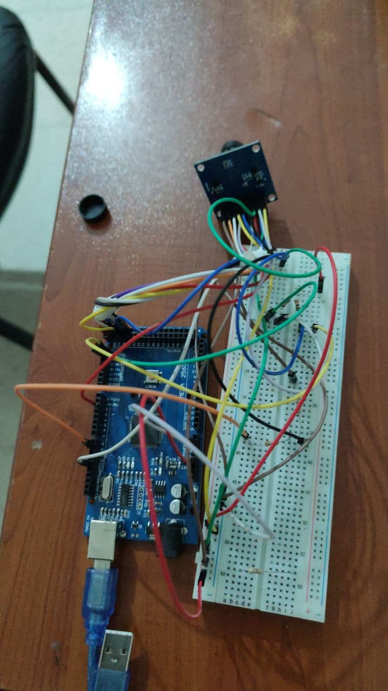

# Colour-Detection-with-Arduino-Camera-Module-OV7670-using-OpenCV
This project focuses on the development of a color detection system using an Arduino microcontroller and the OV7670 camera module, with image processing performed using  OpenCV. The system captures real-time images, transfers them to a computer via serial communication, and applies color detection algorithms to identify and classify object colors. 

## External References

The camera wiring configuration and the low-level OV7670 camera driver code were referenced from the following open-source repository:

- Indrek Luuk, *LiveOV7670*  
  https://github.com/indrekluuk/LiveOV7670

The computer–camera interaction logic, data processing, and system integration were implemented independently for this project.

Demonstration video link:-
https://drive.google.com/drive/folders/1OIhej4B2XKUGvC6GGtaiLSPV4_49yHhS?usp=sharing

